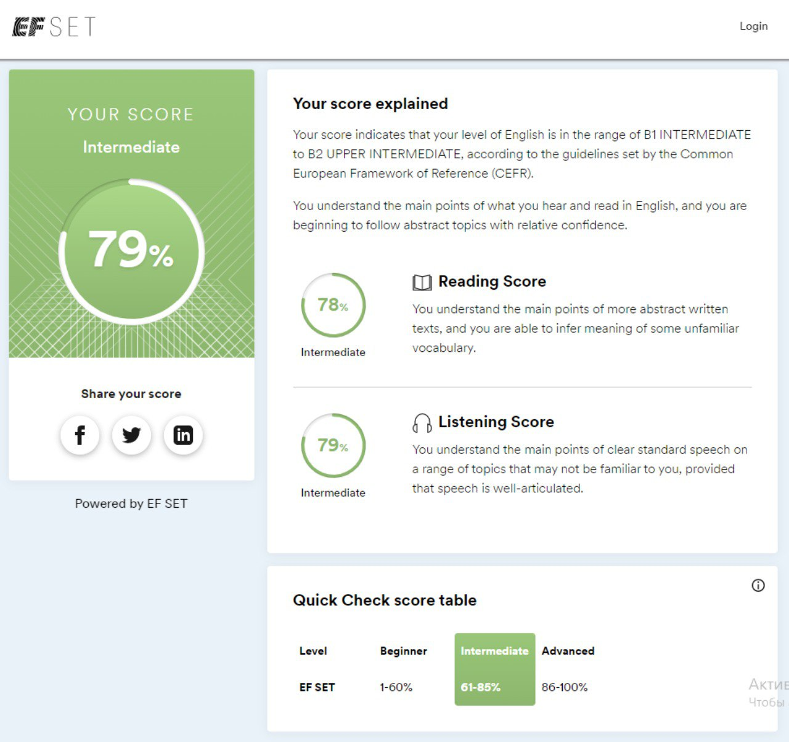

# **Kanstantsin Klimenia**

## Junior FrontEnd Developer
## Contacts:
* Location: Warszawa, Poland
* Phone: +48 516 601 379
* E-mail: kostyaklimenya1304@gmail.com
* Telegram: @g_kke
## About me
I started my career in a leading insurance company in Belarus when I was 18 years old. Then I worked in a clothing store and in a pizzeria.
My acquaintance with the IT-sphere began at the beginning of 2020. Then I worked as an auditor's assistant on a project in an IT company. And since that time, I began to be more interested in various areas in IT. 
At the beginning of 2022, I learned about the RSSchool and decided to learn more about the IT.
So here I am :)
## Skills
* HTML (basic)
* CSS (basic)
* JavaScript (basic)
* Git (basic)
## Code example
```
function name() {
    let userFirstName = "Kanstantsin";
    console.log(userFirstName);
    let userSecondName = "Klimenia";
    console.log(userSecondName);
}
name();
```
## Education
* Minsk College of Entrepreneurship (2014-2017)
* Belarusian State Economic University (2017-2021)
## Courses
* HTML and CSS [Code Basics courses](https://code-basics.com/)
* HTML, CSS and JavaScript basics [WAYUP courses](https://wayup.in/)
# Languages
* English: Intermediate according to the [EFSET](https://www.efset.org/)

* Polish: A0-A1
